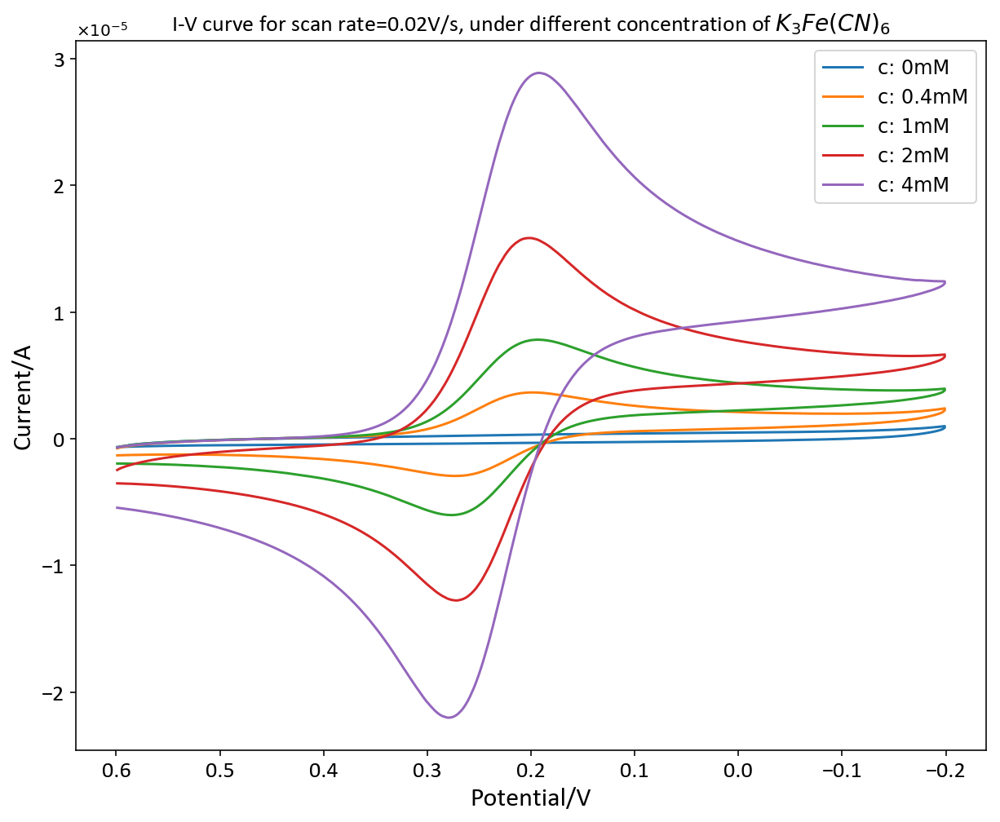
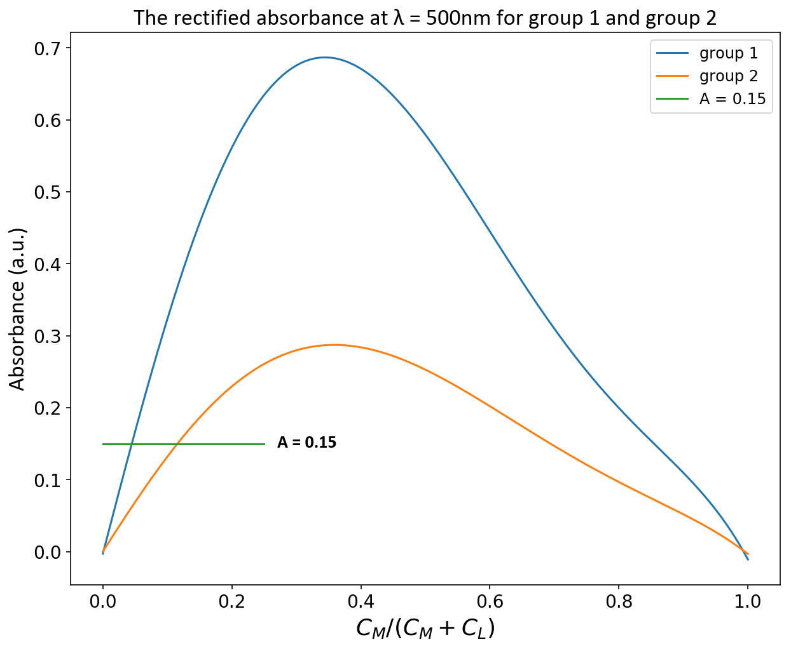

# Physical_chemistry_experiment_19-fall
Original data, codes, jupyter notebooks, figures and results for physical chemistry experiment of 19 fall

## Contents
1. [experiment 1](experiment_1/figure_and_result.md)
2. [experiment 2](experiment_2/figures_and_results.pdf)
3. [experiment 3]()
4. [experiment 4](experiment_4/figures_and_results.pdf)
5. [experiment 5](experiment_5/figures_and_results.pdf)
7. [experiment 7](experiment_7/figures.pdf)
8. [experiment 8](experiment_8/figures_and_results.pdf)
9. [experiment 9](experiment_9/figures_and_results.pdf)
10. [experiment 10](experiment_10/figures_and_results.pdf)

## Demo figures

