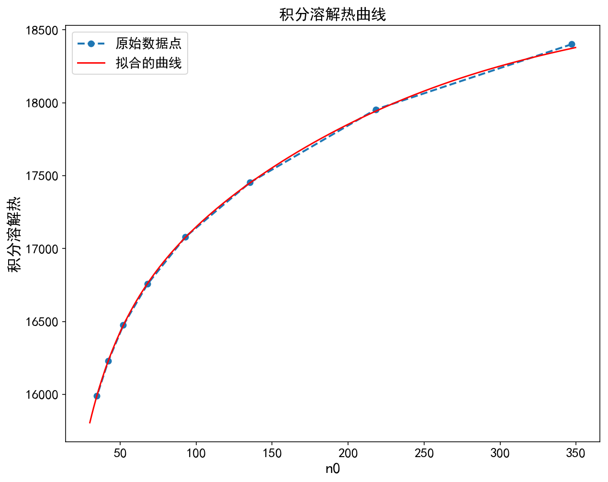

## Figure and calculation results

n0 = 80时，积分溶解热为 16927.596 J/mol
n0 = 80时，微分稀释热为 12.578 J/mol
n0 = 100时，积分溶解热为 17149.400 J/mol
n0 = 100时，微分稀释热为 9.870 J/mol
n0 = 200时，积分溶解热为 17852.168 J/mol
n0 = 200时，微分稀释热为 5.202 J/mol
n0 = 300时，积分溶解热为 18251.222 J/mol
n0 = 300时，微分稀释热为 2.939 J/mol
n0 = 400时，积分溶解热为 18481.800 J/mol
n0 = 400时，微分稀释热为 1.945 J/mol

n01 = 80, n02 = 100时，积分稀释热为 221.804 J/mol
n01 = 100, n02 = 200时，积分稀释热为 702.768 J/mol
n01 = 200, n02 = 300时，积分稀释热为 399.053 J/mol
n01 = 300, n02 = 400时，积分稀释热为 230.578 J/mol