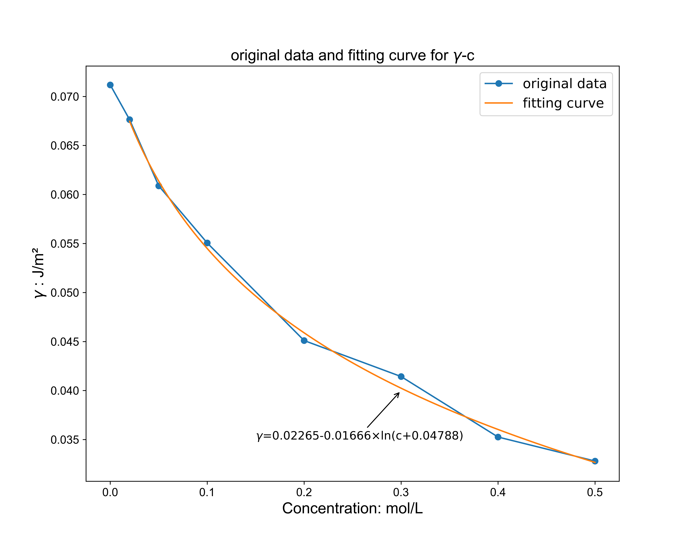
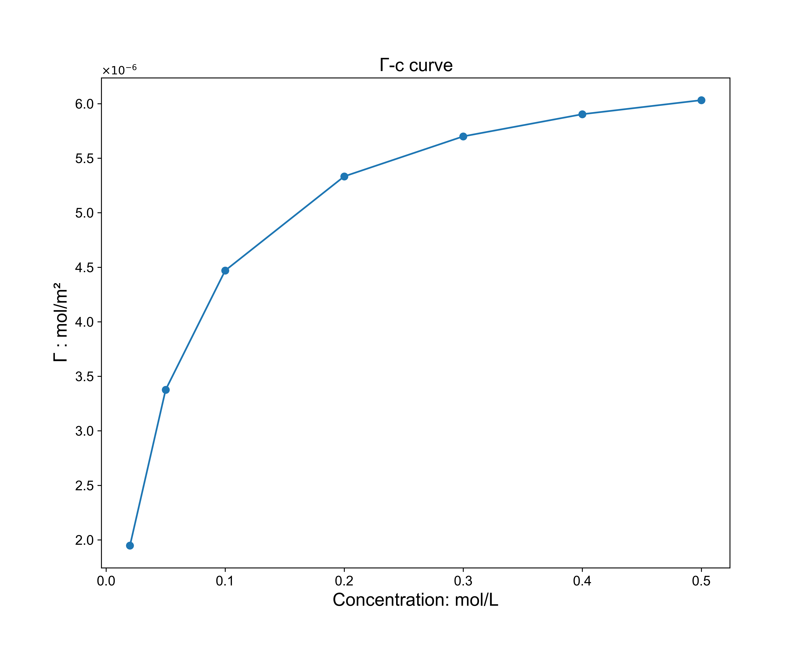
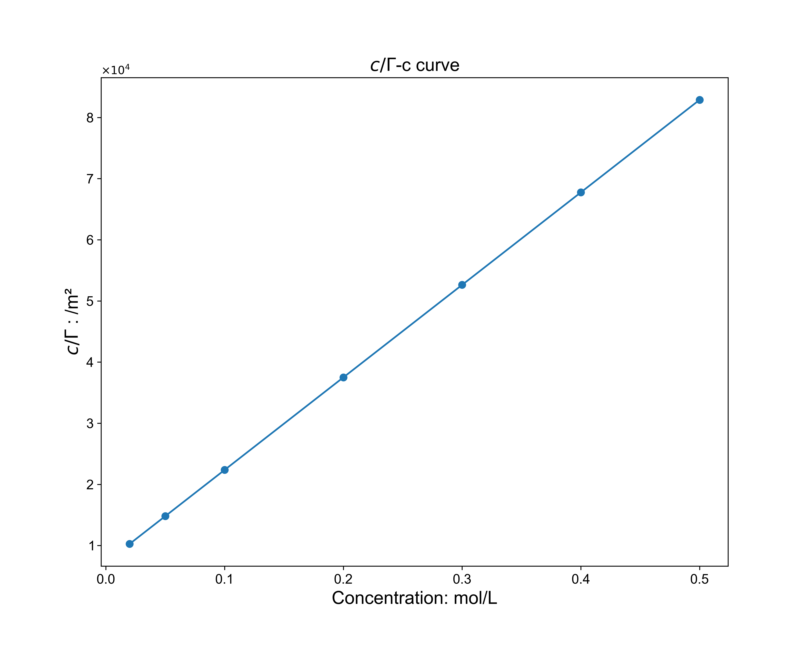

数据表如下：
|            |   #1  |   #2  |   #3  |   #4  |   #5  | Average (Kpa) |    γ (J/m²)    |
|:----------:|:-----:|:-----:|:-----:|:-----:|:-----:|:-------:|:-------:|
|     H2O    | 0.581 |  0.58 | 0.583 | 0.582 | 0.583 |  0.5818 | 0.07118 |
| 0.02 mol/L | 0.552 | 0.553 | 0.553 | 0.554 | 0.552 |  0.5528 | 0.06763 |
| 0.05 mol/L | 0.497 | 0.498 | 0.497 | 0.498 | 0.498 |  0.4976 | 0.06088 |
|  0.1 mol/L |  0.45 |  0.45 | 0.448 | 0.449 | 0.453 |   0.45  | 0.05506 |
|  0.2 mol/L | 0.369 | 0.368 | 0.369 | 0.368 | 0.369 |  0.3686 | 0.04510 |
|  0.3 mol/L | 0.339 | 0.338 | 0.339 |  0.34 | 0.337 |  0.3386 | 0.04143 |
|  0.4 mol/L | 0.288 | 0.289 | 0.288 | 0.289 | 0.287 |  0.2882 | 0.03526 |
|  0.5 mol/L | 0.268 | 0.268 | 0.269 | 0.268 | 0.268 |  0.2682 | 0.03281 |

 根据公式 $\frac{\gamma_{1}}{\gamma_{2}}=\frac{\Delta p_{1}}{\Delta p_{2}}$ 可以通过各个浓度下的压强计算出此浓度下溶液的表面张力 $\gamma$ (见上表最后一列). 

 $\gamma-c$图如下：

 根据公式 $\Gamma=-\frac{c}{RT}(\frac{d\gamma}{dc})$ 可以通过各个浓度下的 $\gamma-c$ 曲线的斜率 (可以通过对拟合曲线的表达式求导来计算) 计算出此浓度下溶液的吸附量 $\Gamma$. 

 $\Gamma-c$图如下：

 从上图可以看出，随着浓度的增大，溶液的吸附量增大但逐渐趋于一个饱和值. 

 同时可以得到每个浓度下的 $\frac{c}{\Gamma}$, 做出 $\frac{c}{\Gamma}-c$ 图如下：

 发现是一条直线, 说明 $\Gamma$ 和 $c$ 之间有如下关系：

$\frac{c}{\Gamma}=ac+b$, 其中 $a,b$ 为常数.

所以 $\Gamma=\frac{c}{ac+b}, \lim\limits_{c\to+\infty}\Gamma=constant$.