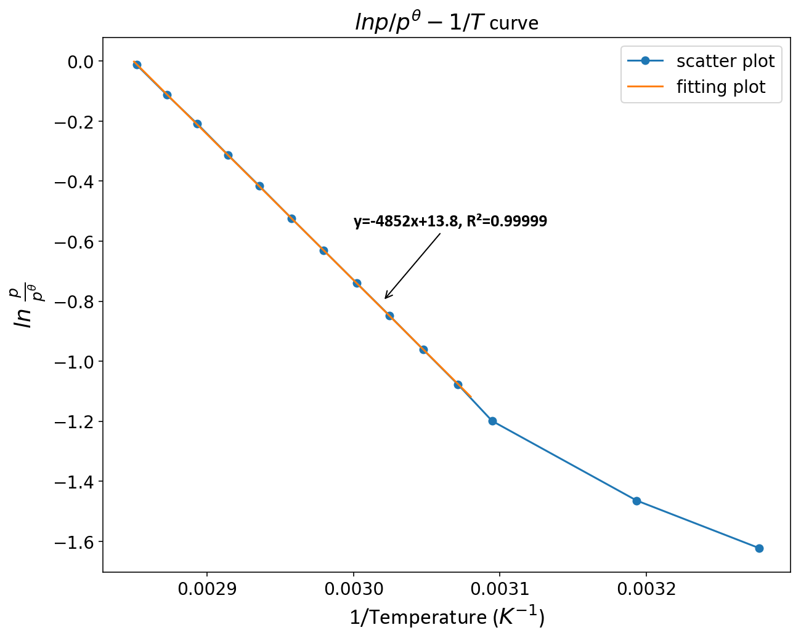

data for P(饱和蒸气压，KPa)-T(温度，°C)：
| T (°C)  | 32    | 40    | 49.99 | 52.46 | 54.98 | 57.48 | 59.95 | 62.48 | 64.96 | 67.49 | 69.98 | 72.49 | 75   | 77.51 |
|---------|-------|-------|-------|-------|-------|-------|-------|-------|-------|-------|-------|-------|------|-------|
| P (KPa) | 19.74 | 23.13 | 30.15 | 34.07 | 38.24 | 42.83 | 47.73 | 53.26 | 59.21 | 65.96 | 73.09 | 81.13 | 89.4 | 98.73 |

初始的几个数据点 (T=32, 40, 50°C) 偏离直线，拟合的时候舍去，拟合得到的表达式为 $y=-4852x+13.8$, $R^{2}=0.99999$

带入相应物理量可知，表达式为 $ln(\frac{p}{p^{\theta}})=-4852\times\frac{1}{T}+13.8$

根据 Clausius-Clapeyron 方程, 有$$ln(\frac{p}{p^{\theta}})=-\frac{\Delta_{vap}H_{m}}{RT}+A$$
直线的斜率为 $$-\frac{\Delta_{vap}H_{m}}{R}$$  
所以 $$\Delta_{vap}H_{m}=-k\times R$$

$k$ 是直线的斜率，$R$ 是理想气体常数

代入计算得, $\Delta_{vap}H_{m}=40339.5\ J/mol$, 与文献值接近 ($42.3 ± 0.4\ KJ/mol$, 来自 [NIST Chemistry WebBook](https://webbook.nist.gov/cgi/cbook.cgi?ID=C64175&Units=SI&Mask=4#Thermo-Phase))

气化熵定义为 $$\Delta_{vap} S=\frac{\Delta_{vap}H_{m}}{T_{b}} \qquad \quad (T_{b}是沸点)$$

代入计算得, 气化熵 $= 114.95\ J/(mol·K)$

Trouton规则:
>很多种液体的气化熵是一个定值，大约是 $10.5R$ ($R$ 为理想气体常数), 或 $85-88\ J/(mol·K)$

显然乙醇不符合Trouton规则，这是合理的. 因为Trouton规则本来就不适用于能形成分子间氢键的液体：分子间氢键会使液体的熵变小，故液体气化时的熵变增大，也就是气化熵变大.

