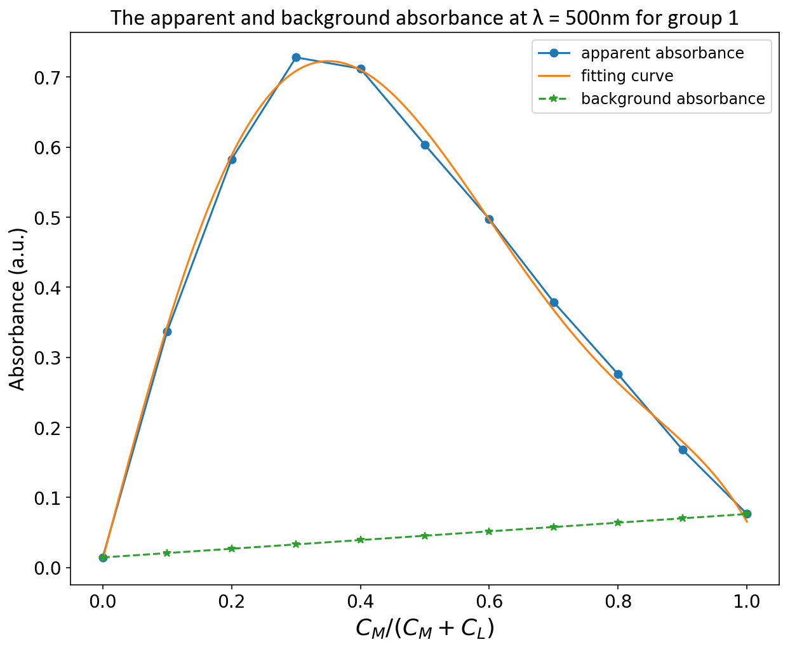
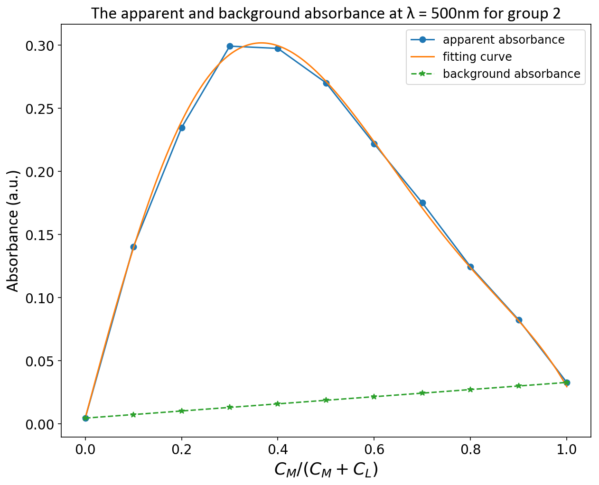

 未校正的吸光度 ($ at\ \lambda=500 nm $) 

 已校正的吸光度 ($ at\ \lambda=500 nm $) 

 由上图可知，校正后的吸光度在 $C_{M}/C_{M}+C_{L}=0.35$ 取到最大值，所以 $n=C_{L}/C_{M}=1/0.35-1=1.857\approx 2$. 

做 $A = 0.15$ 的水平线与两曲线分别交于 $x=0.0448, x=0.1154$

再根据方程 $$K = \frac{y}{(C_{M1}-y)(C_{L1}-ny)^{n}} = \frac{y}{(C_{M2}-y)(C_{L2}-ny)^{n}}$$

代入数据解得: $y = 0.02109\ mmol，K = 8.5×10^{7}\ mol^{-2}\ L^{2}$
